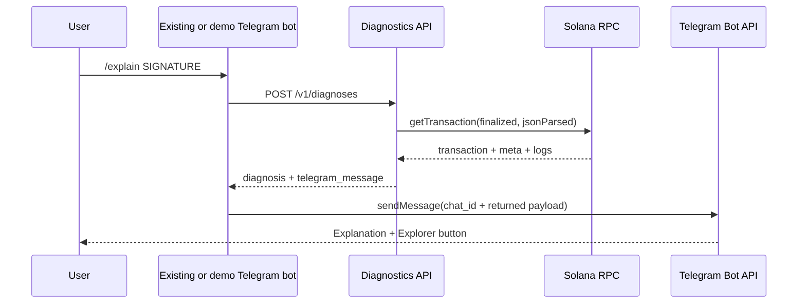

# API and Telegram integration contract

## Integration goal

- Provide a language-neutral service that an existing trading bot can call after receiving a failed Solana transaction signature.
- Keep Telegram credentials and chat identity inside the calling bot.
- Return both structured diagnosis data and a ready-to-send Telegram message model.
- Prove the contract with an independent demo bot.

## Integration sequence



## Public HTTP endpoints

| Method | Path | Purpose |
|---|---|---|
| `POST` | `/v1/diagnoses` | Analyze one transaction signature |
| `GET` | `/v1/examples` | Return stable checked-in demo cases and expected categories |
| `GET` | `/health/live` | Process liveness |
| `GET` | `/health/ready` | Configuration and dependency readiness |

## `POST /v1/diagnoses`

### Request headers

- `Content-Type: application/json`.
- `Accept: application/json`.
- `X-Request-Id`: optional caller-provided identifier after validation.
- `Authorization`: absent for local development; API key or internal policy for a private integration.

### Request body

```json
{
  "signature": "5DLZ8sA6FPFThpKiD2QGzX3ufPjbV3hRk7Xf7P1A7m3kgB6KX6wcRcND4BdWXNwfbJxV1XNo7JooZJsj7GBrcuYn",
  "cluster": "mainnet-beta",
  "include": {
    "telegram_message": true,
    "log_tail": true
  }
}
```

### Request rules

- `signature`:
  - Required.
  - Trim surrounding whitespace.
  - Parse with Solana signature parsing rather than regex alone.
  - Reject multiple signatures or embedded URLs.
- `cluster`:
  - Optional in `0.1`.
  - Defaults to `mainnet-beta`.
  - Reject every other cluster in `0.1`.
- `include.telegram_message`:
  - Optional.
  - Defaults to `true`.
- `include.log_tail`:
  - Optional.
  - Defaults to `true`.
  - Returned log lines remain bounded and escaped.

### Successful failed-transaction response

```json
{
  "schema_version": "1",
  "classifier_version": "0.1.0",
  "request_id": "01J...",
  "signature": "5DLZ8sA6FPFThpKiD2QGzX3ufPjbV3hRk7Xf7P1A7m3kgB6KX6wcRcND4BdWXNwfbJxV1XNo7JooZJsj7GBrcuYn",
  "cluster": "mainnet-beta",
  "status": "failed",
  "category": "insufficient_transfer_balance",
  "title": "Trade failed: insufficient SOL",
  "explanation": "The transaction attempted to transfer 2.5 SOL while the runtime reported 2.10097936 SOL available.",
  "confidence": "confirmed",
  "fee_lamports": "55000",
  "fee_sol": "0.000055",
  "compute_units_consumed": "16863",
  "failed_instruction": {
    "top_level_index": 3,
    "program_id": "11111111111111111111111111111111",
    "custom_code": 1
  },
  "evidence": [
    {
      "kind": "runtime_log",
      "value": "Transfer: insufficient lamports 2100979360, need 2500000000",
      "source_path": "meta.logMessages",
      "strength": "primary",
      "redacted": false
    },
    {
      "kind": "fee",
      "value": "55000",
      "source_path": "meta.fee",
      "strength": "supporting",
      "redacted": false
    }
  ],
  "next_actions": [
    "Reduce the requested amount or ensure the wallet has enough SOL for the amount, fees, and account requirements.",
    "Request a fresh transaction instead of resubmitting the same signed transaction."
  ],
  "sources": [
    {
      "program_id": "11111111111111111111111111111111",
      "code": "runtime-log",
      "name": "insufficient lamports",
      "source_url": "https://solana.com/docs/rpc/json-structures",
      "verified_at": "2026-09-23"
    }
  ],
  "explorer_url": "https://explorer.solana.com/tx/5DLZ8sA6FPFThpKiD2QGzX3ufPjbV3hRk7Xf7P1A7m3kgB6KX6wcRcND4BdWXNwfbJxV1XNo7JooZJsj7GBrcuYn",
  "telegram_message": {
    "text": "<b>Trade failed: insufficient SOL</b>\n\nAttempted: <code>2.5 SOL</code>\nAvailable: <code>2.10097936 SOL</code>\nFee charged: <code>0.000055 SOL</code>\nConfidence: <b>Confirmed</b>\n\nEvidence: <code>Transfer: insufficient lamports 2100979360, need 2500000000</code>",
    "parse_mode": "HTML",
    "link_preview_options": {
      "is_disabled": true
    },
    "reply_markup": {
      "inline_keyboard": [
        [
          {
            "text": "View transaction",
            "url": "https://explorer.solana.com/tx/5DLZ8sA6FPFThpKiD2QGzX3ufPjbV3hRk7Xf7P1A7m3kgB6KX6wcRcND4BdWXNwfbJxV1XNo7JooZJsj7GBrcuYn"
          }
        ]
      ]
    }
  },
  "analyzed_at": "2026-09-23T00:00:00Z"
}
```

### Unknown-result response requirements

- HTTP status: `200`.
- `status`: `failed`.
- `category`: `unknown_program_error` or `unknown_transaction_error`.
- `confidence`: `unknown`.
- Include:
  - Failed instruction index when available.
  - Program ID when defensible.
  - Custom code when present.
  - Fee.
  - Bounded relevant logs.
  - Explorer link.
- Exclude:
  - Guessed error names.
  - Unverified remediation.
  - AI-generated explanations.

## HTTP status model

| HTTP | API code | Meaning | Retry guidance |
|---:|---|---|---|
| `200` | `diagnosed` | Failed transaction analyzed, including unknown classification | Do not retry automatically |
| `200` | `transaction_succeeded` | Signature belongs to a successful transaction | No diagnosis required |
| `400` | `invalid_request` | Malformed JSON or unsupported fields | Fix request |
| `400` | `invalid_signature` | Input is not one Solana signature | Fix signature |
| `404` | `transaction_unavailable` | RPC returned `null` at requested commitment | Retry later only if transaction may still finalize |
| `422` | `unsupported_transaction_version` | Transaction version exceeds version `0.1` support | Upgrade service |
| `422` | `metadata_unavailable` | Transaction exists but required metadata is missing | Manual review |
| `429` | `rate_limited` | Public API limit reached | Respect `Retry-After` |
| `502` | `rpc_invalid_response` | Provider returned malformed or contradictory data | Retry through operator policy |
| `503` | `rpc_unavailable` | Provider timed out or failed | Retry with bounded backoff |
| `500` | `internal_error` | Unexpected internal failure | Use request ID; do not expose internals |

## Telegram message contract

### Returned fields

- `text`:
  - `1–4096` characters after entity parsing.
  - Target maximum: `1200` characters.
  - HTML-escaped chain-controlled values.
- `parse_mode`:
  - `HTML` for version `0.1`.
  - Renderer owns escaping.
- `link_preview_options`:
  - Disable previews for predictable layout.
- `reply_markup`:
  - Inline keyboard.
  - One `View transaction` URL button.
- Excluded:
  - `chat_id`.
  - Telegram token.
  - Reply/thread identifiers.

### Rendering order

1. Status icon and title.
2. Most useful numeric facts.
3. Fee charged.
4. Confidence.
5. One primary evidence line.
6. One or two conservative next actions.
7. Explorer button.

### Status icons

| State | Icon |
|---|---|
| Confirmed classification | `❌` |
| Probable classification | `⚠️` |
| Unknown classification | `❓` |
| Successful transaction | `✅` |
| Temporarily unavailable | `⏳` |
| Invalid input | `✍️` |

### Rendering constraints

- Do not render raw HTML from logs.
- Do not render more than one raw evidence line in the primary message.
- Truncate long program-controlled values with an explicit marker.
- Keep the full bounded evidence in the API response and web detail view.
- Do not use MarkdownV2 unless every special character is covered by tests.
- Do not say `your wallet` unless caller context proves wallet ownership.
- Do not say `your fee` unless caller context proves fee-payer ownership.
- Default wording: `Transaction fee reported by RPC`.

## Demo Telegram bot

### Commands

| Command | Behavior |
|---|---|
| `/start` | Explain the bot's read-only purpose and privacy boundary |
| `/explain <signature>` | Analyze one signature and return the rendered result |
| `/examples` | Show buttons for confirmed insufficient balance, confirmed slippage, and unknown custom error |
| `/help` | Show syntax, supported scope, and unsupported off-chain errors |
| `/privacy` | State what is sent to RPC and what is logged |

### Plain-text input convenience

- Accept one message containing only one signature.
- Reject transaction URLs in version `0.1` unless a dedicated safe URL parser is implemented.
- Reject wallet addresses.
- Reject seed phrases and private keys with a generic safety response without echoing the content.
- Never store arbitrary incoming message text.

### Demo-bot processing

1. Receive command or text update.
2. Extract one signature.
3. Send a temporary `Analyzing transaction…` message or chat action.
4. Call diagnostics API with strict timeout.
5. Render API errors into short bot states.
6. Send or edit the final message.
7. Attach Explorer button.
8. Log only request ID, state, and latency.

### Update transport

- Local development:
  - Long polling.
  - No public webhook required.
- Hosted demo:
  - Prefer webhook when the hosting platform provides stable HTTPS and secret-path validation.
  - Use long polling only on a continuously running worker.
- Existing integration:
  - The calling bot remains responsible for its own update transport.

## Existing-bot connector

### Required integration data

- Failed transaction signature.
- Optional internal correlation ID.
- Optional desired output locale; English only in version `0.1`.

### Existing-bot pseudoflow

```text
if trade_result has landed_failed_signature:
    diagnosis = POST diagnostics_service/v1/diagnoses(signature)
    telegram_payload = diagnosis.telegram_message
    telegram_payload.chat_id = existing_chat_id
    telegram_payload.reply_parameters = existing_reply_context
    existing_bot.send_message(telegram_payload)
else:
    preserve existing off-chain failure handling
```

### What the connector proves

- Diagnostics service does not require access to private trading logic.
- Existing bot does not share its Telegram token.
- Existing bot retains message delivery control.
- Integration can be introduced behind a feature flag.
- Existing generic failure message remains the fallback.

### What cannot be completed externally

- Direct connection to a third-party production system without access and authorization.
- Access to its bot token, source code, user IDs, transaction builder, provider logs, or internal failure states.
- Diagnosis of errors that occur before a Solana signature exists.
- Validation of compatibility with private program mappings.

## Authentication and abuse controls

### Public demo

- Per-IP rate limit.
- Global RPC concurrency limit.
- Bounded request queue.
- Optional CAPTCHA only if measured abuse requires it.
- No public bulk wallet scanning.

### Private integration

- Static service API key initially.
- Rotate through deployment secret manager.
- Prefer internal networking or workload identity when available.
- Add signature replay protection only if a future endpoint accepts mutable actions; diagnosis is read-only and idempotent.

## Compatibility policy

- API schema changes:
  - Additive fields allowed within `v1`.
  - Category meaning cannot change silently.
  - Breaking changes require `/v2`.
- Classifier changes:
  - Increment `classifier_version` whenever matching or wording changes materially.
  - Preserve regression fixtures for prior bugs.
- Telegram changes:
  - Depend only on stable `sendMessage` fields needed by version `0.1`.
  - Keep raw Bot API output types separate from `teloxide` types.
- Solana changes:
  - Reject unsupported transaction versions explicitly.
  - Reverify response structures and dependency versions during implementation.
