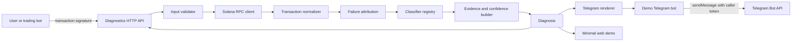

# Architecture

## System context



## Architectural boundaries

### Trusted project code

- Signature validator.
- RPC request builder.
- RPC response schema validator.
- Transaction normalizer.
- Invocation-log parser.
- Deterministic classifier registry.
- Evidence and confidence builder.
- Telegram and web renderers.
- Checked-in fixtures and expected outputs.

### Untrusted inputs

- User-supplied signature text.
- RPC JSON.
- Program addresses.
- Transaction instructions.
- Program logs.
- Error strings.
- Telegram message text.
- HTTP headers and client IP metadata.

### External dependencies

- Solana mainnet RPC provider.
- Telegram Bot API.
- Solana Explorer links.
- Program-specific documentation used to maintain error mappings.
- Deployment platform.

## Proposed repository layout

```text
Cargo.toml
Cargo.lock
src/
  lib.rs
  domain/
    mod.rs
    diagnosis.rs
    evidence.rs
    confidence.rs
    errors.rs
  rpc/
    mod.rs
    client.rs
    models.rs
    validation.rs
  normalize/
    mod.rs
    transaction.rs
    instructions.rs
    invocation_logs.rs
  classify/
    mod.rs
    registry.rs
    system_program.rs
    jupiter.rs
    unknown.rs
  render/
    mod.rs
    telegram.rs
    plain_text.rs
  api/
    mod.rs
    routes.rs
    models.rs
    errors.rs
    middleware.rs
  telemetry/
    mod.rs
    metrics.rs
    tracing.rs
  bin/
    server.rs
    telegram_bot.rs
web/
  src/
  public/
fixtures/
  mainnet/
    manifest.yaml
    insufficient_transfer.json
    jupiter_slippage_6001.json
    unknown_custom_error.json
tests/
  api_contract.rs
  fixture_regression.rs
  telegram_rendering.rs
docs/
Dockerfile
docker-compose.yml
.env.example
.github/workflows/ci.yml
```

## Module map

| Module | Responsibility | Must not do |
|---|---|---|
| `domain` | Stable types for diagnosis, evidence, confidence, source mapping, and errors | Know about Axum, Telegram, HTML, or RPC transport |
| `rpc` | Build `getTransaction` requests, enforce timeout, deserialize and validate responses | Classify errors or render user copy |
| `normalize` | Convert RPC-specific structures into stable internal transaction and invocation models | Guess an error meaning |
| `classify` | Evaluate deterministic classifiers in priority order | Perform network calls or emit presentation markup |
| `render` | Convert a diagnosis into plain text and Telegram-safe output | Reclassify evidence or alter confidence |
| `api` | Validate HTTP input, call the application service, map typed errors to HTTP responses | Contain classifier business logic |
| `telegram_bot` | Parse commands, call the HTTP API, and send a message with its own token | Receive wallet secrets or duplicate core classification logic |
| `telemetry` | Emit safe metrics, request IDs, structured logs, and latency | Log raw credentials or unbounded transaction data |
| `web` | Provide reviewer-facing form and preloaded evidence examples | Call Telegram or expose private configuration |

## Core domain model

### `Diagnosis`

| Field | Type | Requirement |
|---|---|---|
| `schema_version` | String | Start at `1` |
| `classifier_version` | String | Build or ruleset identifier |
| `signature` | String | Canonical validated base58 form |
| `cluster` | Enum | `mainnet-beta` only in `0.1` |
| `status` | Enum | `failed`, `succeeded`, or `unavailable` |
| `category` | Enum | Stable machine-readable category |
| `title` | String | Short user-facing summary |
| `explanation` | String | Evidence-backed explanation |
| `confidence` | Enum | `confirmed`, `probable`, or `unknown` |
| `fee_lamports` | Optional integer | Copy from `meta.fee`; serialize as a decimal string in JSON if needed for cross-language safety |
| `compute_units_consumed` | Optional integer | Copy from metadata when present |
| `failed_instruction` | Optional object | Top-level index, program ID, and instruction representation |
| `error` | Optional object | Normalized transaction and instruction error |
| `evidence` | Array | Ordered evidence items supporting the result |
| `next_actions` | Array | Conservative user options; no automatic execution advice |
| `sources` | Array | Documentation mappings used by the classifier |
| `explorer_url` | String | Mainnet transaction URL |
| `analyzed_at` | UTC timestamp | Analysis time, not transaction time |
| `request_id` | String | Safe support and trace correlation identifier |

### `EvidenceItem`

| Field | Values |
|---|---|
| `kind` | `transaction_error`, `instruction_error`, `program_id`, `runtime_log`, `program_log`, `fee`, `compute_units`, or `rpc_state` |
| `value` | Sanitized exact value used by the classifier |
| `source_path` | RPC path or normalized path such as `meta.err.InstructionError[1]` |
| `strength` | `primary` or `supporting` |
| `redacted` | Boolean |

### `SourceMapping`

| Field | Requirement |
|---|---|
| `program_id` | Exact program address that owns the mapping |
| `code` | Numeric or named error value |
| `name` | Verified error name |
| `source_url` | Primary documentation or source-code URL |
| `verified_at` | UTC date |
| `notes` | Version or compatibility limitation |

## RPC contract

### Request

- Method: `getTransaction`.
- Parameters:
  - Validated signature.
  - `commitment: finalized`.
  - `encoding: jsonParsed`.
  - `maxSupportedTransactionVersion: 0` for version `0.1`.
- Timeout:
  - Connect timeout: 2 seconds.
  - Total request timeout: 8 seconds.
  - Values must remain configurable.
- Retry policy:
  - No retry for invalid request or `null` result.
  - At most one retry for transport errors and HTTP `5xx`.
  - Respect `429` and `Retry-After` when supplied.
  - Add bounded jitter.

### Response validation

- Reject malformed JSON-RPC envelopes.
- Reject a response whose ID does not match the request.
- Accept `result: null` as `transaction_unavailable`.
- Accept `meta: null` as `metadata_unavailable`.
- Preserve absent optional fields.
- Bound log count and log-line length before retaining or rendering.
- Reject unsupported future transaction versions with an explicit state.
- Never deserialize program-controlled strings into executable instructions.

## Normalization pipeline

1. Validate the RPC envelope.
2. Extract slot, block time, transaction version, signatures, message, and metadata.
3. Resolve the complete ordered account-key list from parsed account keys.
4. Identify the fee payer from transaction message ordering and signer metadata.
5. Normalize the top-level transaction error.
6. If `InstructionError` exists:
   - Extract the top-level instruction index.
   - Resolve its direct program ID.
   - Preserve the instruction representation.
7. Parse invocation logs with an explicit stack:
   - Push on `Program <id> invoke [depth]`.
   - Record logs against the current invocation.
   - Pop on matching `success` or `failed`.
   - Mark malformed sequences rather than repairing silently.
8. Select the terminal failed invocation when defensible.
9. Build a normalized transaction object independent of RPC JSON types.
10. Pass the immutable normalized object to the classifier registry.

## Failure attribution rules

- Top-level instruction index is authoritative for the outer instruction.
- Direct program ID is not automatically the deepest failing program.
- A terminal `Program <id> failed:` log can identify the deepest recorded failure.
- Nested CPI attribution requires consistent invocation depth and termination logs.
- Missing or truncated logs reduce confidence.
- Multiple failure-looking strings do not create multiple primary diagnoses.
- The selected failing program and alternate candidates remain available as evidence.
- A program-specific numeric mapping requires exact program-ID equality.

## Classifier interface

```text
Classifier
  id() -> stable identifier
  version() -> mapping version
  evaluate(normalized_transaction) -> no_match | candidate

Candidate
  category
  explanation parameters
  confidence
  primary evidence
  supporting evidence
  safe next actions
  documentation sources
  priority
```

## Classifier precedence

1. Explicit insufficient-lamports runtime evidence.
2. Exact Jupiter program ID plus documented custom code `6001`.
3. Generic custom-program error with attribution.
4. Generic transaction failure.

## Initial classifier details

### Insufficient transfer balance

- Match conditions:
  - Runtime log matches the exact supported grammar for insufficient lamports.
  - Available and required amounts parse as unsigned integers.
- Output:
  - Available lamports.
  - Required lamports.
  - Decimal-safe SOL rendering.
  - Exact supporting log.
- Confidence:
  - `confirmed` when grammar and numeric parsing both succeed.
  - No match when the message is partial or malformed.
- Safety:
  - Do not calculate an exact deposit recommendation.

### Jupiter slippage tolerance exceeded

- Match conditions:
  - Failing program ID equals the mapped Jupiter swap program.
  - Custom error code equals `6001`.
- Output:
  - Documented name `SlippageToleranceExceeded`.
  - Explanation that execution crossed the permitted threshold.
  - Safe next actions that require reviewing a fresh quote and risk.
- Confidence:
  - `confirmed` only when program and code both match.
- Mapping warning:
  - Do not apply `6001` to another program.
  - Reverify Jupiter program documentation before release.

### Unknown program error

- Match conditions:
  - Instruction error contains a custom code.
  - No verified program-specific classifier matches.
- Output:
  - Program ID.
  - Custom code.
  - Failed instruction index.
  - Relevant log tail.
  - Fee.
- Confidence: `unknown`.
- Product behavior:
  - Treat as a valid diagnosis response.
  - Never replace with AI-generated speculation.

## Telegram rendering boundary

- Input: `Diagnosis` only.
- Output:
  - Text capped below Telegram's current 4096-character `sendMessage` limit.
  - Parse mode selected explicitly.
  - Escaped user- and chain-controlled strings.
  - Inline keyboard with one Explorer URL button.
- Excluded fields:
  - Bot token.
  - `chat_id`.
  - User identity.
  - Internal RPC credentials.
- Caller responsibilities:
  - Add `chat_id`.
  - Authenticate to Telegram.
  - Apply its own reply/thread behavior.

## Caching and idempotency

- Cache key: `cluster + signature + classifier_version`.
- Cache only:
  - Finalized transaction diagnoses.
  - Successful `transaction_succeeded` analyses.
- Do not cache:
  - Provider timeouts.
  - Rate limits.
  - Temporary `transaction_unavailable` results beyond a short negative TTL.
- Version `0.1` storage:
  - In-memory bounded least-recently-used cache.
  - Fixed maximum entries.
  - Fixed maximum total retained bytes where practical.
- Determinism:
  - Same fixture plus same classifier version must produce byte-equivalent normalized output after volatile fields are removed.

## API security

- Maximum request body size: 4 KiB.
- Signature character and parsed-length validation before RPC access.
- Per-IP rate limit for public demo.
- Global concurrency limit for outbound RPC calls.
- Explicit CORS allowlist for the hosted web origin.
- No reflected RPC or log content in error pages.
- No arbitrary RPC URL accepted from the client.
- No arbitrary Explorer URL accepted from the client.
- No bot token accepted by the diagnostics endpoint.
- Secrets loaded only from environment or deployment secret store.
- Logs redact:
  - Authorization headers.
  - RPC URLs containing credentials.
  - Telegram tokens.
  - Full client IP where not operationally required.

## Observability

### Structured logs

- Request ID.
- Result state.
- Classifier ID.
- Confidence.
- RPC latency.
- Total latency.
- Cache hit or miss.
- Provider error category.
- Telegram send result for demo bot.
- Never log full raw RPC responses by default.

### Metrics

- Diagnosis requests by result.
- Classifier matches by category.
- Unknown classification rate.
- RPC latency histogram.
- API latency histogram.
- Cache hit ratio.
- RPC `429`, timeout, and `5xx` counts.
- Telegram delivery failures.

### Health endpoints

- `/health/live`:
  - Process is running.
  - No external call.
- `/health/ready`:
  - Configuration parsed.
  - Required secrets present for enabled components.
  - Optional shallow RPC health check with strict timeout.

## Deployment topology

### Version `0.1`

- One Rust container:
  - HTTP API.
  - Optional demo-bot process as a separate binary/container command.
- One static web deployment.
- No database.
- One configured Solana RPC endpoint.
- One Telegram bot token only in the demo-bot runtime.

### Later integration option

- Deploy diagnostics as an internal service.
- Authenticate callers with a service API key or network policy.
- Let the existing trading bot own Telegram delivery.
- Add provider failover and persistent caching only after measured need.

## Architecture decisions deferred until implementation

| Decision | Default | Verification required |
|---|---|---|
| Solana RPC Rust dependency | Prefer typed current Solana/Agave client if its parsed models fit; otherwise use narrow JSON-RPC models with `reqwest` | Confirm current official crate versions and transaction-model compatibility |
| HTTP framework | Axum | Confirm current stable crate version |
| Demo bot framework | `teloxide` for basic commands, or raw Bot API if current compatibility blocks required fields | Confirm current Bot API support; `teloxide 0.17.0` documents Bot API `9.1` while Telegram currently documents `10.3` |
| Web framework | Vite plus React and TypeScript | Confirm deployment target and current stable versions |
| Hosting | Container host for Rust plus static host for web | Confirm free-tier sleep behavior and HTTPS webhook support |
| Bot update transport | Long polling for local development; webhook or worker long polling for hosted demo | Choose after hosting selection |
