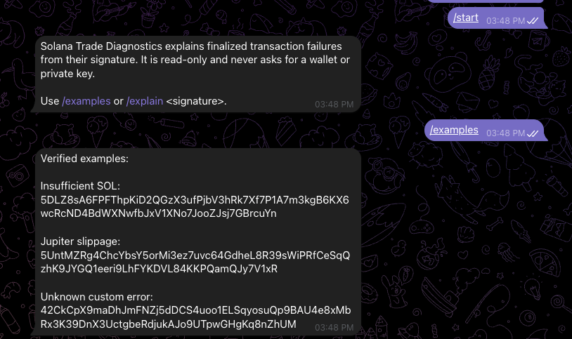
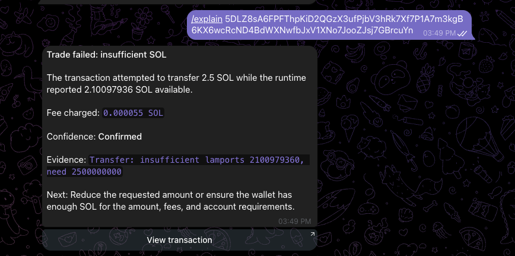
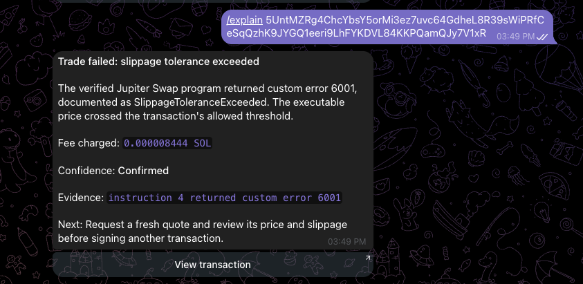
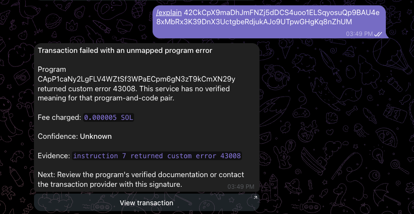

# End-to-end test evidence

## Test record

- Date: 24 September 2026.
- Cluster: Solana mainnet-beta.
- Entry point: real Telegram bot using long polling.
- Diagnostics service: local Rust HTTP API.
- Transaction source: live Helius RPC using finalized `getTransaction` requests.
- Result: all initial classification paths and invalid-input handling behaved as expected.

## Integration path exercised

```text
Telegram command
  -> demo bot
  -> POST /v1/diagnoses
  -> signature validation
  -> live Solana getTransaction
  -> response normalization
  -> invocation-log attribution
  -> deterministic classification
  -> Telegram-safe rendering
  -> Telegram sendMessage
```

No wallet was connected, no transaction was signed, and no transaction was submitted.

## Results

| Test | Expected result | Observed result |
|---|---|---|
| `/start` | Explain the read-only purpose and supported commands | Passed |
| `/examples` | Return the three verified mainnet examples | Passed |
| Insufficient-SOL signature | Confirmed `insufficient_transfer_balance` with exact runtime evidence | Passed |
| Jupiter signature | Confirmed `jupiter_slippage_tolerance_exceeded` for Jupiter program error `6001` | Passed |
| Unmapped-program signature | Unknown-confidence `unknown_program_error` without an invented meaning | Passed |
| `/explain hello` | Reject malformed input without making a diagnosis | Passed |
| `View transaction` | Open the matching transaction in Solana Explorer | Passed |

## Bot start and examples

The bot states its read-only boundary and exposes three reproducible example signatures.



## Confirmed insufficient SOL

The transaction attempted to transfer `2.5 SOL`; the runtime reported `2.10097936 SOL` available and emitted the exact insufficient-lamports evidence. The response also reports the charged fee and links to the matching Explorer transaction.



- Transaction: [Solana Explorer](https://explorer.solana.com/tx/5DLZ8sA6FPFThpKiD2QGzX3ufPjbV3hRk7Xf7P1A7m3kgB6KX6wcRcND4BdWXNwfbJxV1XNo7JooZJsj7GBrcuYn?cluster=mainnet)
- Failed top-level instruction: index `3`, displayed as instruction `#4` in Explorer.
- Fee: `0.000055 SOL`.
- Confidence: `confirmed`.

## Confirmed Jupiter slippage

The service binds error `6001` to the verified Jupiter Swap program before applying the documented `SlippageToleranceExceeded` meaning.



- Failed program: `JUP6LkbZbjS1jKKwapdHNy74zcZ3tLUZoi5QNyVTaV4`.
- Custom error: `6001`.
- Fee: `0.000008444 SOL`.
- Confidence: `confirmed`.

## Unknown program error

The service preserves the program, instruction, code, and fee while explicitly declining to invent an unverified meaning.



- Failed program: `CApP1caNy2LgFLV4WZtSf3WPaECpm6gN3zT9kCmXN29y`.
- Custom error: `43008`.
- Fee: `0.000005 SOL`.
- Confidence: `unknown`.

## Invalid input

A malformed signature returns a short validation failure instead of calling the transaction classifier.


## Scope of this evidence

This test demonstrates the complete local product path with a live RPC provider and the real Telegram Bot API. It does not claim hosted production uptime, multi-provider failover, or support for off-chain bot and quote failures.
